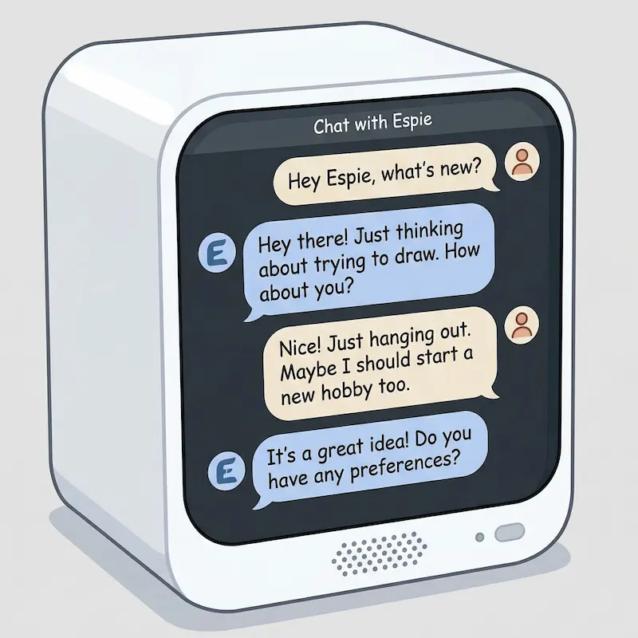
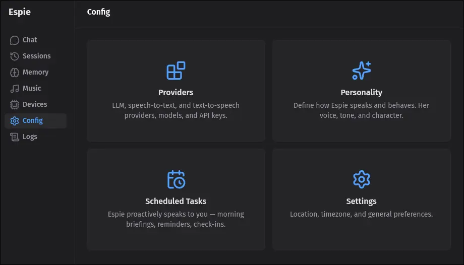
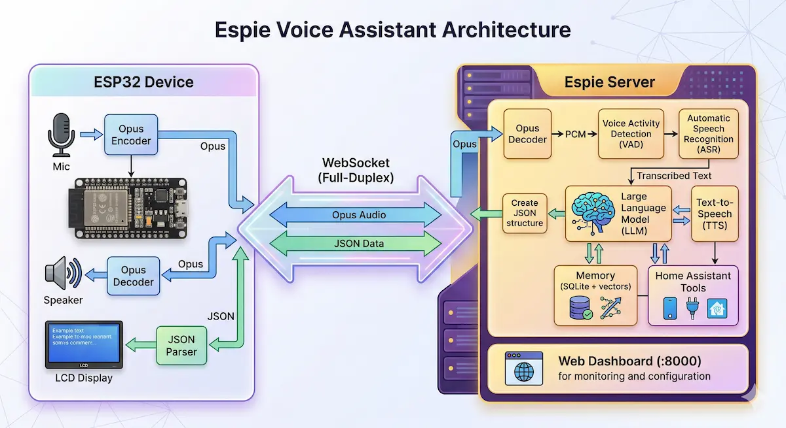
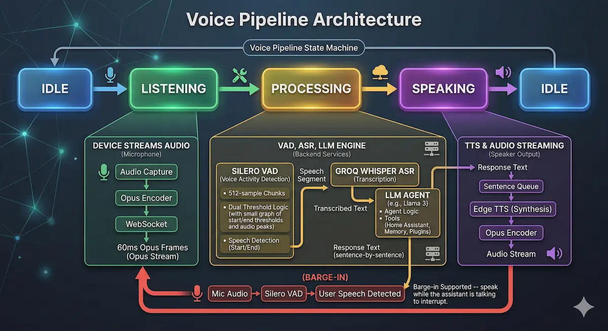

<p align="center">
  
</p>

# Espie — Private Voice Assistant

A self-hosted, privacy-first voice assistant for the dozens of cheap ESP32-based AI chat devices flooding AliExpress, Banggood, and Amazon (~$20). These little boxes — sold under names like "DeepSeek AI Chat Box", "AI Voice Assistant", etc. — all run the same [XiaoZhi ESP32](https://github.com/78/xiaozhi-esp32) open-source firmware and connect to a Chinese cloud platform by default. Espie replaces that entire backend with a modern TypeScript server that keeps your voice data local, lets you choose your own LLM provider, and gives the device a dramatically better UI.

<p align="center">
  
</p>

**Why this exists.** The stock experience sends all your audio to Chinese servers, locks you into Chinese LLM providers, often replies with Chinese characters even when you speak English, and has a pretty bare-bones interface. Espie is a ground-up replacement: fully self-hosted, multilingual, extensible through tools and plugins, and built on a modern Nuxt 4 / TypeScript stack instead of the original Python server.

The firmware side is heavily patched too. The stock device shows a static emoji face and not much else. Espie adds chat bubbles, swipe gestures to navigate between screens (chat, now playing, weather, clock), Home Assistant smart home control, YouTube Music playback, local weather display, and scheduled proactive conversations. The whole thing is designed to be easy to extend with your own ideas — add a new screen, a new tool, a new voice trigger.

## What It Does

Talk to an ESP32 device on your desk. It listens, transcribes your speech, sends it to any LLM (Anthropic, OpenAI, Google, Groq, and 20+ more), speaks the response back, and displays chat bubbles on a small LCD. It remembers things you tell it, controls your smart home, plays music from YouTube Music, shows your local weather, and can proactively talk to you on a schedule -- a morning briefing, a reminder, a check-in before bed. Swipe the touchscreen to flip between screens.

The device connects over WiFi to a server running Espie. All audio processing happens server-side -- the ESP32 just streams Opus audio and plays it back.

## Architecture

The ESP32 device connects to the Espie server over a single WebSocket. It streams Opus-encoded audio from its microphone, and the server runs the full voice pipeline — VAD to detect speech, Whisper ASR for transcription, an LLM agent with tools (Home Assistant, memory, YouTube Music), and Edge TTS to synthesize a response back as Opus audio. The web dashboard connects on the same port for text chat, config, and monitoring.

<p align="center">
  
</p>

## Service Stack

| Component | Provider | API Key? |
|-----------|----------|:--------:|
| **ASR** (Speech-to-Text) | Groq Whisper | Yes (free tier) |
| **LLM** (Brain) | Any of 23+ providers via [pi-ai](https://github.com/nicepkg/pi-ai) | Yes |
| **TTS** (Text-to-Speech) | Microsoft Edge TTS (auto-language, 30+ languages) | No |
| **VAD** (Voice Activity) | Silero VAD v5 (local ONNX) | No |
| **Embeddings** (Memory) | FastEmbed / bge-small-en-v1.5 (local ONNX, 384 dims, English-optimized) | No |
| **Smart Home** | Home Assistant REST API | HA token |
| **Database** | SQLite + sqlite-vec | No |

## Compatible Hardware

The upstream XiaoZhi firmware supports **70+ boards** across ESP32-S3, ESP32-C3, ESP32-C6, and ESP32-P4 chips. In practice, any ESP32-based device sold as a "XiaoZhi" or "DeepSeek AI Chat Box" should work -- just select the right board config at build time. These devices are widely available for around $15-25 from AliExpress, Banggood, Amazon, and Taobao, from manufacturers like Spotpear, Waveshare, LiChuang, LILYGO, M5Stack, and many others.

The server runs on anything with Node.js 20+ -- a Raspberry Pi, a NUC, a laptop, a VM.

**Currently tested with:**

- **Spotpear ESP32-S3-1.54-MUMA** ("ESP32-S3 DeepSeek AI Chat Box 1.54 inch LCD N16R8") -- ESP32-S3 N16R8, 1.54" ST7789 LCD, ES8311 audio, CST816D touch. Full-featured: touch gestures, swipe between screens, tap to talk.
- **Generic ESP32-S3 1.54" TFT DevKit** (expansion adapter kit with MAX98357A + INMP441) -- ESP32-S3 N16R8, 1.54" ST7789 LCD, I2S audio, no touch. Push-to-talk only via BOOT button. No swipe gestures or screen navigation.

The firmware auto-detects which board it's running on at boot (probes I2C for the ES8311 codec). No config change needed -- the same binary works on both.

If you've tested another board, open an issue or PR to add it here.

## Quick Start

### Prerequisites

- Node.js 20+
- Docker (optional, for containerized deployment)
- A Groq API key (free at [console.groq.com](https://console.groq.com))
- An LLM API key (Anthropic, OpenAI, Google, etc.)

### 1. Configure

```bash
cd espie/
cp .env.example .env
# Edit .env with your API keys:
#   GROQ_API_KEY=gsk_...
#   ANTHROPIC_API_KEY=sk-ant-...  (or any other LLM provider)
```

### 2. Run the Server

```bash
npm install
NUXT_PORT=8000 npx nuxt dev --host 0.0.0.0
```

Or with Docker:

```bash
docker compose build && docker compose up -d
```

### 3. Flash the ESP32

**Option A: Browser flash wizard (no toolchain needed)**

The Devices page has a built-in flash wizard that provisions your ESP32 directly from the browser. Pre-built firmware is included — no ESP-IDF installation required.

1. Open `http://localhost:8000/devices` in Chrome
2. Plug in your ESP32 via USB
3. Click **Connect Device** and select the serial port
4. Enter your WiFi credentials and click **Flash Firmware**
5. Device reboots, connects to WiFi, and appears in the dashboard

> Requires a Chromium browser (Chrome, Edge, Brave) and HTTPS or localhost. Firefox/Safari are not supported (no Web Serial API).

**Option B: Build from source**

Requires [ESP-IDF v5.5.2+](https://docs.espressif.com/projects/esp-idf/en/latest/esp32s3/get-started/).

```bash
cd firmware/

# Update sdkconfig with your server IP:
#   CONFIG_OTA_URL="http://YOUR_SERVER_IP:8000/xiaozhi/ota/"

./build.sh          # Build firmware
./flash.sh          # Build + flash (auto-detects serial port on macOS & Linux)
./monitor.sh        # Serial monitor (Ctrl+] to exit)
```

The scripts auto-detect your serial port and source ESP-IDF from `~/esp-idf` (override with `IDF_PATH`). See `./flash.sh --help` for options like `--no-build` or passing a specific port.

The firmware OTA URL is baked in at compile time. If your server IP changes, you need to rebuild and reflash.

### 4. Iterate (OTA Dev Workflow)

After the first USB flash, you never need to plug in again. The `dev-ota.sh` script builds the firmware, copies the binary to the server's OTA directory, and reboots the device over WiFi:

```bash
cd firmware/
./dev-ota.sh              # build + copy + reboot device wirelessly
./dev-ota.sh --no-reboot  # build + copy only
./dev-ota.sh --flash      # USB flash (first time or recovery)
```

Each build gets a timestamped dev version (e.g. `1.0.0.20260330183045`). The device reboots, checks OTA, downloads the new binary, and restarts. No USB, no button pressing. The Devices page in the dashboard also has a Reboot button.

If the server runs on a different machine (e.g. a Raspberry Pi), rsync the binary after building locally:
```bash
rsync espie/data/bin/*.bin pi:~/xiaozhi/espie/data/bin/
```

## Web Dashboard

Open `http://your-server:8000` for the management dashboard:

- **Chat** -- Text chat with the assistant (same brain as voice)
- **Sessions** -- View conversation history from the device
- **Memory** -- Browse and manage stored facts
- **Music** -- Browse the downloaded library, play/scrub/download/delete tracks
- **Devices** -- Connected ESP32 devices + **browser flash wizard**
- **Tasks** -- Scheduled proactive tasks (briefings, reminders)
- **Config** -- LLM provider, ASR model, TTS voice, API keys, personality prompt
- **Logs** -- Live server logs (SSE)

## Voice Pipeline

<p align="center">
  
</p>

1. **Listening**: Device streams 60ms Opus frames over WebSocket
2. **VAD**: Silero VAD detects speech start/end (512-sample chunks, dual threshold)
3. **ASR**: Speech segment sent to Groq Whisper for transcription
4. **LLM**: Transcribed text -> agent with tools (Home Assistant, memory, plugins)
5. **Language detection**: User's transcription analyzed via franc-min trigram analysis
6. **TTS**: Response streamed sentence-by-sentence -> Edge TTS (voice auto-matched to detected language) -> Opus -> device

Barge-in supported -- speak while the assistant is talking to interrupt.

## Proactive Conversations

Most voice assistants just respond. Espie can also *initiate* -- she'll proactively speak to you on a schedule, with full access to all her tools. A morning briefing that checks your smart home and weather. A bedtime reminder that turns off any lights you left on. A midday check-in. Whatever you want.

Create and manage schedules from the dashboard (**Tasks** page):

- **Frequency**: daily, weekdays only, weekends only, or every hour
- **Prompt**: natural language instructions for what Espie should say and do
- **Enable/disable**: toggle individual schedules without deleting them
- **Timezone**: per-schedule timezone support

When a schedule fires, Espie spins up a full agent session -- the same LLM, tools, and memory as a voice conversation -- runs the prompt, synthesizes speech, and delivers audio to the connected device. If no device is connected, it skips silently.

**Example schedules:**

| Name | When | Prompt |
|------|------|--------|
| Morning briefing | 7:00 AM daily | Good morning! Check the weather and mention any lights or devices left on overnight. |
| Focus check-in | Every hour on weekdays | Quick check-in. Keep it to one sentence unless something important came up. |
| Bedtime | 10:00 PM daily | Wind-down time. Turn off any lights still on and say goodnight. |

## Memory

The assistant remembers facts across sessions using vector-based semantic search:

- **Embeddings**: FastEmbed (BAAI/bge-small-en-v1.5, 384 dims, local ONNX, English-optimized)
- **Storage**: SQLite with sqlite-vec for KNN vector search
- **Dedup**: Cosine similarity > 0.9 updates existing facts instead of creating duplicates
- **Tools**: `save_memory` and `recall_memory` available to the LLM agent

## Home Assistant Integration

Seven built-in tools for smart home control via the HA REST API:

`ha_get_state` `ha_list_entities` `ha_call_service` `ha_turn_on` `ha_turn_off` `ha_toggle` `ha_trigger_automation`

Configure your Home Assistant URL and long-lived access token from the dashboard (**Config > Home Assistant**). The page includes a connection test that shows your instance name, version, and entity count. Environment variables (`HA_BASE_URL`, `HA_TOKEN` in `.env`) also work as a fallback.

## Music / Jukebox

A built-in jukebox plays music from YouTube Music -- by voice or from the dashboard. The agent searches with `yt-dlp`, downloads the audio as MP3, caches it, and plays it back.

- **Voice/chat tools**: `play_music` (*"play Bohemian Rhapsody"* -- searches YouTube Music, downloads, and plays) and `list_music` (browse the downloaded library)
- **Library**: tracks are cached as MP3 under `data/ytmusic/` (override with `YTMUSIC_DIR`) and reused on repeat requests -- no re-download
- **Music page** (dashboard): browse the library, play/pause, scrub the progress bar, download, and delete tracks
- **Playback**: songs play on the connected ESP32, and the dashboard Chat returns a playable URL so the same track plays in your browser

Downloads use `yt-dlp` and `ffmpeg`, both bundled in the Docker images -- nothing to install.

## Project Structure

```
espie/                           # TypeScript server + dashboard
  app/                           # Nuxt 4 frontend (Vue 3, NuxtUI v4)
  server/
    agent/                       # AgentSession wrapper for pi-agent-core
    providers/                   # ASR, TTS, LLM, VAD, embeddings
    routes/xiaozhi/v1.ts         # ESP32 WebSocket protocol
    tools/                       # HA tools, memory tools, plugins
    utils/                       # Voice pipeline, config, DB, scheduler
  data/                          # Runtime data (DB, config). Gitignored.
  data/firmware/                 # Pre-built firmware for browser flash. Committed.
firmware/                        # ESP32 firmware (C++, ESP-IDF)
```

## Multilingual Support

Speak any language -- Espie auto-detects it and responds with a native voice. Groq Whisper transcribes 50+ languages natively, the LLM mirrors whatever language you use, and Edge TTS auto-selects a gender-matched voice for 30+ languages (Italian, French, German, Spanish, Portuguese, Japanese, Korean, Chinese, Russian, Arabic, and many more). Language is detected once per turn from your speech, so every sentence in the response uses the same voice -- no mid-sentence switching.

The embedding model (bge-small-en-v1.5) is English-optimized, so memory recall works best in English. Firmware UI strings are English.

## Constraints

- **OTA URL is compile-time** -- firmware must be rebuilt if the server IP changes
- **Memory is English-optimized** -- semantic search uses an English embedding model; recall in other languages may be less accurate

## Credits

- ESP32 firmware forked from [78/xiaozhi-esp32](https://github.com/78/xiaozhi-esp32) (MIT)
- LLM providers via [pi-ai](https://github.com/nicepkg/pi-ai)
- Agent framework via [pi-agent-core](https://github.com/nicepkg/pi-agent-core)
